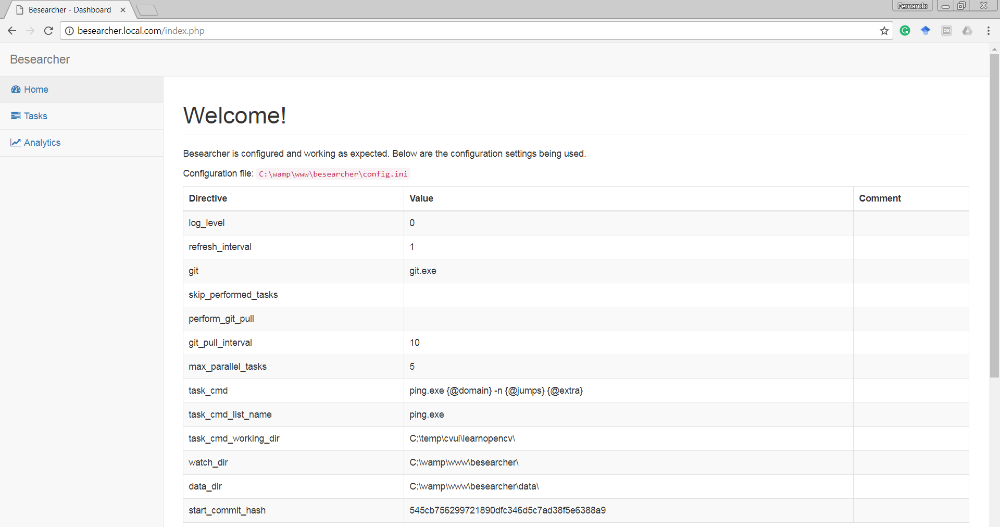
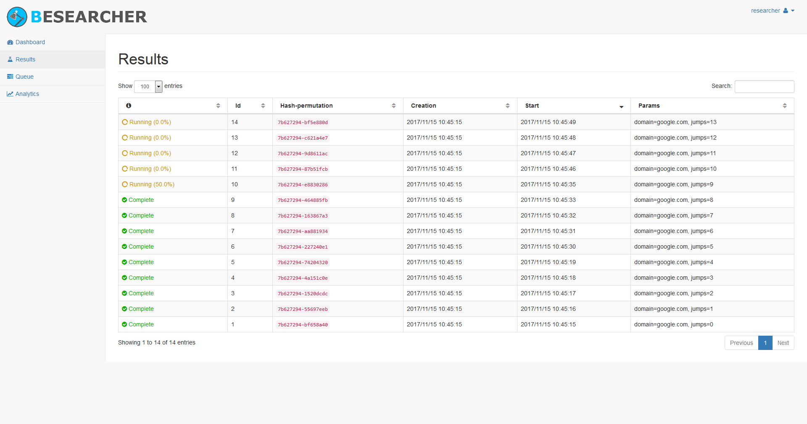
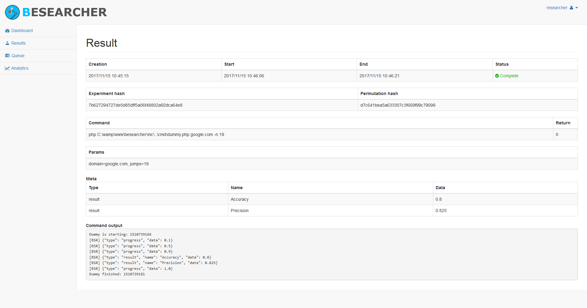
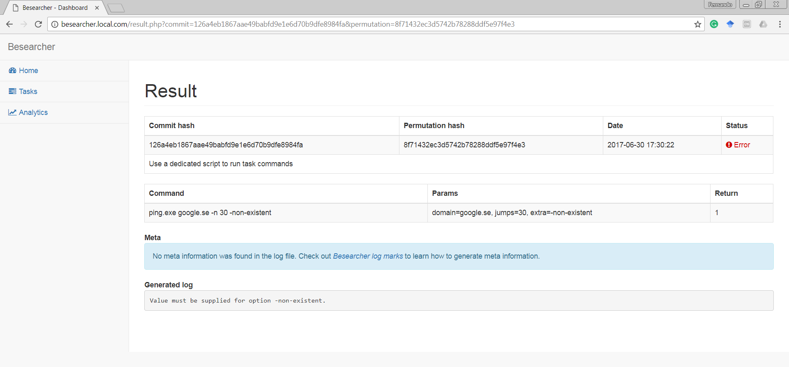

Besearcher
======================

Besearcher (bot researcher) is a tool to help researchers automate and keep track of software-based experiments. It automatically monitors a git repository and performs a pre-defined command for each new commit. It is also possible to keep track of commands (running, finished or aborted) and the output they produced.  

## Table of content

- [Features](#features)
- [Installation](#installation)
- [Getting started](#getting-started)
	- [Prerequisites](#prerequisites)
	- [Installing](#installing)
	- [Configuring](#configuring)
- [Usage](#usage)
- [License](#license)
- [Changelog](#changelog)

## Features

Besearcher was created out of a need from a scientific project, so its design values reproducibility and trackability of results. It is easy to use, has minimal dependencies (PHP and Git) and focus on preventing repetitive and boring tasks. It also has an (optional) web dashboard that allows users to easily and quickly monitor tasks:

[](./www/img/screenshots/besearcher-home.png)

[](./www/img/screenshots/besearcher-tasks.png)

[](./www/img/screenshots/besearcher-result-complete.png)

[](./www/img/screenshots/besearcher-result-error.png)

## Getting started

These instructions will get you a copy of Besearcher up and running on your machine.

### Prerequisites

You need [PHP](http://php.net) and [Git](https://git-for-windows.github.io/) available in the command line to run Besearcher. If you intend to use the web dashboard (recommended), you need a web server with PHP support. [Wamp](http://www.wampserver.com/en/) is an easy choice.

### Installing

Go to the folder where you want to install Besearcher, e.g. `c:\`:

```
cd c:\
```

Clone Besearcher's repository:

```
git clone https://github.com/Dovyski/besearcher.git besearcher
```

Create a configuration file using the example file provided with Besearcher:

```
copy besearcher\config.ini-example besearcher\config.ini
```

If you intend to use the web dashboard, you also need a configuration file for it:

```
copy besearcher\www\config.ini-example besearcher\www\config.ini
```

### Configuring

Besearcher has two configuration files: `besearcher\config.ini` which controls the behavior of Besearcher, and `besearcher\www\config.ini` which controls the web dashboard.

Let's start with the first one. Open `besearcher\config.ini` in your editor of choice. Search for the line with the directive `watch_dir` and inform the **absolute** path of a cloned git repository that Besearcher will monitor. For example:

```
watch_dir = "c:\experiment\"
```

Next search for the line with the directive `data_dir` and inform the **absolute** path of a directory that Besearcher can use to store task results and internal data. For example:

```
data_dir = "c:\experiment\besearcher\"
```

Finally search for the line with the directive `task_cmd`, which is the command Besearcher will execute everytime a new commit arrives in `watch_dir`:

```
task_cmd = "test.exe --blah={@data} {@debug} --input={@files}"
```

The section `[task_params]` in the config file contains the values that will be used to parametrize the task indicated by `task_cmd`. Before executing the `task_cmd` string, Besearcher will replace strings like `{@name}` with the values informed in the `[task_params]` section. Any param under that section can be used as `{@name}`. For instance, the following configuration:

```
task_cmd = test.exe --blah={@data} {@debug} --input={@files}

[task_params]
data = hi
debug = -d
files[] = 1
files[] = 2
```

will produce the following commands to be executed:

```
test.exe --blah=hi -d --input=1
test.exe --blah=hi -d --input=2
```

In that case, `{@data}` is replaced by the value of the param named `data` within the `[task_cmd_params]` section, as well as `{@debug}` is replaced by the value of the param `debug` (which is `-d`). The value of `{@files}` will be replaced by `1` and by `2`, because `{@files}` was defined as an array. If more than one param is defined as an array, Besearcher will generate all possible permutations with the informed param values.

Now let's configure the web dashboard, if you are using it. Open `besearcher\www\config.ini` in your editor of choice. Set the directive `besearcher_ini_file` to the path of the `config.ini` file being used by Besearcher.

For example, if besearcher is installed in `c:\besearcher`, the path to the configuration INI file will be:  

```
besearcher_ini_file = "c:\besearcher\config.ini"
```

In order to make the web dashboard available in the browser, you need to create a virtual host or equivalent in your web server and point its document root to the `www` folder within Besearcher's installation folder.

## Usage

Go to the folder where Besearcher was installed and run:

```
php besearcher.php --ini=config.ini
```

Besearcher will continue to run and watch the directory in the `config.ini` file. While running, Besearcher will execute the command specified in `task_cmd` for every new commit that arrives in the watched directory.

Please check the file [config.ini-example](config.ini-example) for more usage information.

## License

Researcher is licensed under the terms of the [MIT](https://choosealicense.com/licenses/mit/) Open Source
license and is available for free.

## Changelog

See all changes in the [CHANGELOG](CHANGELOG.md) file.
