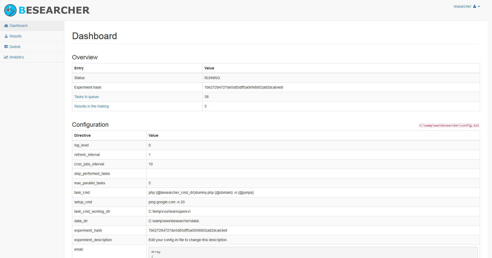

Besearcher
======================

Besearcher (bot researcher) is a tool to help researchers automate and keep track of software-based experiments. It automatically monitors a git repository and performs a pre-defined command for each new commit. It is also possible to keep track of commands (running, finished or aborted) and the output they produced.  

## Table of content

- [Features](#features)
- [Installation](#installation)
- [Getting started](#usage)
	- [Basic features](#basic-features)
	- [Command permutations](#command-permutations)
	- [Web dashboard](#web-dashboard)
- [License](#license)
- [Changelog](#changelog)

## Features

## Installation

You need PHP installed and available in the commmand line.

## Getting started

Please check the file [config.ini-example](config.ini-example) for usage information.

### Basic usage

Please check the file [config.ini-example](config.ini-example) for usage information.

### Command permutations

Please check the file [config.ini-example](config.ini-example) for usage information.

### Web dashboard

Please check the file [config.ini-example](config.ini-example) for usage information.

## License

Researcher is licensed under the terms of the [MIT](https://choosealicense.com/licenses/mit/) Open Source
license and is available for free.

## Changelog

See all changes in the [CHANGELOG](CHANGELOG.md) file.
